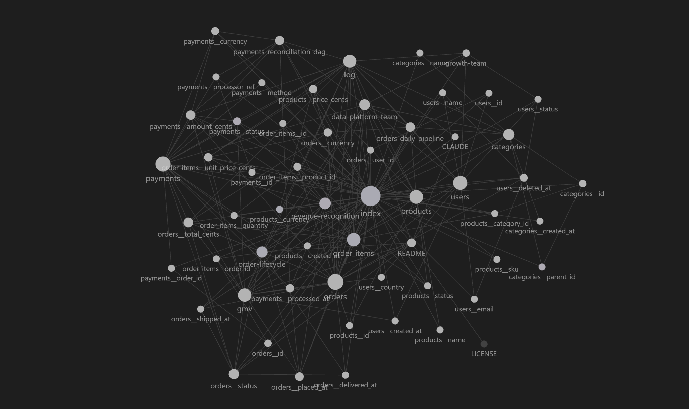

# Data Dictionary & Lineage Wiki

> An LLM-maintained knowledge base that documents every table, column, pipeline, owner, and business concept in a data stack — built with the [LLM Wiki pattern](#credits).

Every data team eventually drowns in undocumented tables, mystery columns, and tribal knowledge. This repo is the opposite: a structured, interlinked, **LLM-maintained** wiki that lives alongside the data and stays current as new sources arrive.

You curate the sources. The LLM does the bookkeeping.

---

## How is this different from RAG?

If you've used ChatGPT file uploads, NotebookLM, or any "chat with your docs" tool, you've used RAG. Here's how this is different:

| | RAG | LLM Wiki (this repo) |
|---|---|---|
| **What gets stored** | The original files, indexed | Original files **+** a written-out wiki the LLM keeps updated |
| **What happens when you ask a question** | The LLM searches the files, finds relevant bits, and writes a fresh answer — every single time | The LLM just reads the wiki page that's already written about it |
| **What happens when you add a new file** | It gets indexed. Nothing else changes. | The LLM reads it, then updates every wiki page it affects, flags contradictions, and adds new links |
| **Does the knowledge build up over time?** | No — every answer starts from zero | Yes — the wiki gets richer with every file you add |

**The simplest way to think about it:**

> **RAG** is like googling something every time you need it.
>
> **The LLM Wiki** is like keeping a notebook — you write things down once, link related notes together, and flip back to it later.

For a data team, this means: instead of asking "what does `orders.status` mean?" and waiting for an LLM to grep through SQL files, you just read [`wiki/columns/orders__status.md`](wiki/columns/orders__status.md) — written, cross-linked, and kept current by the LLM.

---

## What's in this repo

```
data-dict-wiki/
├── CLAUDE.md           # The schema — tells the LLM how to operate
├── raw/                # Source files (read-only — LLM never edits)
│   ├── schemas/        # SQL DDL, dbt models, schema dumps
│   ├── pipelines/      # Airflow DAGs, dbt configs
│   └── slack/          # Exported threads, decision records
├── wiki/               # The wiki itself — LLM owns this
│   ├── index.md        # Catalog of every page (the table of contents)
│   ├── log.md          # Diary: what was ingested when
│   ├── tables/         # One page per physical table
│   ├── columns/        # One page per column ({table}__{column}.md)
│   ├── pipelines/      # One page per pipeline / DAG / dbt model
│   ├── concepts/       # Business concepts (GMV, revenue recognition, …)
│   └── owners/         # Teams or people responsible for data assets
└── .obsidian/          # Obsidian vault config — open this folder as a vault
```

A worked example is already inside: a realistic e-commerce schema (`raw/schemas/sample_ecommerce.sql`) ingested into **53 wiki pages** — 6 tables, 40 columns, 3 concepts, 2 pipeline stubs, 2 owners, all interlinked.

## What it looks like

Obsidian's graph view of the wiki after ingesting `sample_ecommerce.sql`. The big hubs are the tables (`orders`, `users`, `products`, `payments`) and the `index` page; smaller satellites are individual columns; the `gmv`, `order-lifecycle`, and `revenue-recognition` concept pages sit between the tables they pull from.



---

## How it's organized — three layers

| Layer | Folder | Who writes it |
|---|---|---|
| **Raw sources** | `raw/` | You drop files here. Immutable. |
| **Wiki** | `wiki/` | The LLM owns this entirely. |
| **Schema** | `CLAUDE.md` | You and the LLM co-evolve it. |

`CLAUDE.md` is the magic file. It tells the LLM (Claude Code, in this repo) how to ingest, how to name files, what every page template looks like, what tags are allowed, how to handle contradictions, and how to update `index.md` and `log.md`. Read it to understand the conventions; the LLM reads it before every operation.

---

## The three operations

**Ingest.** Drop a file into `raw/...`, ask the LLM to ingest it. The LLM reads it, talks through the takeaways with you, then creates or updates the relevant wiki pages, refreshes `index.md`, and appends an entry to `log.md`. One source at a time, conversationally.

**Query.** Ask a question. The LLM starts at `wiki/index.md`, reads the most relevant pages, follows `[[wiki-links]]` only as needed, and answers — quoting the wiki, not re-reading the raw sources.

**Lint.** Periodically, ask the LLM to health-check the wiki: broken links, stub debt, stale pages, unresolved contradictions. It reports; you decide what to fix.

All three are documented in detail in [`CLAUDE.md`](CLAUDE.md).

---

## Quick start

**1. Clone and open as an Obsidian vault.**

```bash
git clone https://github.com/Saqibnazirbhat/data-dict-wiki.git
```

Then in Obsidian: *Open folder as vault* → pick `data-dict-wiki/`. Open `wiki/index.md` to start browsing. Try the graph view to see the cross-references.

**2. Browse the worked example.**

The wiki is already populated. Some good starting points:

- [`wiki/index.md`](wiki/index.md) — the catalog
- [`wiki/tables/orders.md`](wiki/tables/orders.md) — a fully-documented table
- [`wiki/concepts/order-lifecycle.md`](wiki/concepts/order-lifecycle.md) — a concept page with a state diagram
- [`wiki/concepts/gmv.md`](wiki/concepts/gmv.md) — a concept page that captures *two* common definitions of the same metric (a real-world data-team headache)
- [`wiki/log.md`](wiki/log.md) — the diary of how the wiki was built

**3. Add your own source.**

Drop a SQL file, dbt model, DAG, or Slack thread into `raw/schemas/`, `raw/pipelines/`, or `raw/slack/`. Open Claude Code in the project folder and say:

> Ingest `raw/schemas/my_new_schema.sql`.

Claude will read it, walk through the key takeaways with you, then create/update wiki pages, refresh `index.md`, and append to `log.md`.

**4. (Optional) Bring your own LLM.**

This repo uses Claude Code, but the pattern is LLM-agnostic. Rename `CLAUDE.md` to `AGENTS.md` for OpenAI Codex, `.cursorrules` for Cursor, etc. The schema and templates inside don't change.

---

## Conventions at a glance

- **File names:** snake_case for SQL identifiers, kebab-case for prose. Columns use `{table}__{column}.md` to avoid name collisions with their parent table.
- **Cross-links:** Obsidian `[[wiki-link]]` format with display aliases — `[[order-lifecycle|order lifecycle]]`.
- **Frontmatter:** every page has `type`, `name`, `status` (`stub` / `draft` / `reviewed`), `owner`, `sources`, `tags`, `last_updated`. Plays nicely with the Dataview plugin.
- **Stubs:** any entity referenced but not yet documented gets a one-line stub page so links never break. Tracked in `index.md`.
- **Contradictions:** kept on the page (both versions, both sources, both dates), flagged with `CONTRADICTION:` in `## Notes`, surfaced in `log.md`. Never silently overwritten.

Full spec is in [`CLAUDE.md`](CLAUDE.md).

---

## Why this works

The hard part of a knowledge base isn't reading or thinking — it's **bookkeeping**. Updating cross-references, keeping summaries current, flagging when new data contradicts old claims, maintaining consistency across dozens of pages. Humans abandon wikis because the maintenance burden grows faster than the value.

LLMs don't get bored, don't forget to update a cross-reference, and can touch 15 files in one pass. The wiki stays maintained because the cost of maintenance is near zero.

> *"The human's job is to curate sources, direct the analysis, ask good questions, and think about what it all means. The LLM's job is everything else."*

---

## Credits

The pattern is intentionally **generic** — it works for personal knowledge, research, book notes, competitive analysis, anything where you accumulate sources over time. This repo is one instantiation of it for the **data dictionary & lineage** domain.

Inspired in spirit by Vannevar Bush's [*Memex*](https://en.wikipedia.org/wiki/Memex) (1945) — a personal, curated knowledge store with associative trails between documents. Bush couldn't solve the maintenance problem. The LLM does.

Tools used:
- [Claude Code](https://claude.com/claude-code) — the LLM agent that wrote and maintains the wiki.
- [Obsidian](https://obsidian.md) — the markdown editor / graph viewer / vault browser.

---

## License

[MIT](LICENSE) 
